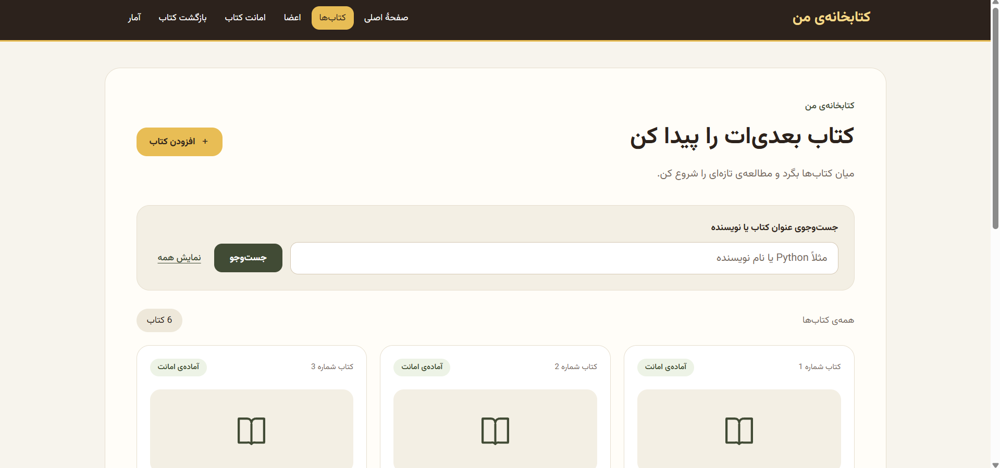
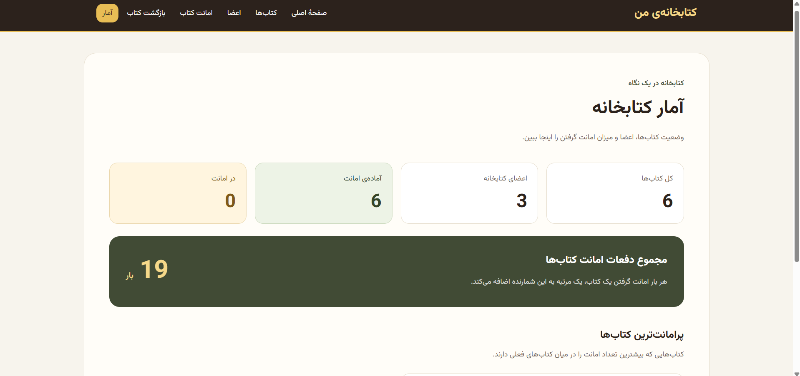

# مدیریت کتابخانه با Django و SQLite

یک برنامهٔ تحت وب برای مدیریت کتاب‌ها، اعضا و امانت‌های کتابخانه،
با رابط کاربری فارسی، راست‌به‌چپ و واکنش‌گرا.

اطلاعات در پایگاه دادهٔ SQLite ذخیره می‌شوند و از طریق Django ORM
مدیریت می‌شوند. نسخهٔ پایگاه داده در شاخهٔ اصلی `main` قرار دارد.

## تصاویر پروژه

### صفحهٔ اصلی


### فهرست و جست‌وجوی کتاب‌ها



### آمار کتابخانه



## امکانات

- نمایش فهرست کتاب‌ها و وضعیت موجودی
- جست‌وجوی کتاب بر اساس عنوان یا نویسنده
- افزودن کتاب جدید با اعتبارسنجی اطلاعات
- نمایش اعضای کتابخانه
- ثبت امانت و جلوگیری از ثبت دو امانت فعال برای یک کتاب
- ثبت بازگشت کتاب
- نمایش سابقهٔ امانت هر عضو
- جداسازی امانت‌های فعال و بازگردانده‌شده
- نمایش آمار کتاب‌ها، اعضا و تعداد دفعات امانت
- نمایش پرامانت‌ترین کتاب‌ها
- نگهداری اطلاعات پس از توقف و راه‌اندازی مجدد سرور
- انتقال اطلاعات نسخهٔ قبلی از JSON به SQLite
- منوی واکنش‌گرا و رابط کاربری فارسی

## فناوری‌ها

- Python
- Django
- SQLite
- Django ORM
- HTML و قالب‌های Django
- Tailwind CSS و CSS اختصاصی
- JavaScript
- Git و GitHub

## ساختار اصلی پروژه

| مسیر | کاربرد |
|---|---|
| `config/` | تنظیمات و مسیرهای اصلی پروژه |
| `library/models.py` | مدل‌های کتاب، عضو و امانت |
| `library/views.py` | پردازش درخواست‌ها و عملیات پایگاه داده |
| `library/urls.py` | مسیرهای برنامه |
| `library/migrations/` | فایل‌های ایجاد و تغییر ساختار پایگاه داده |
| `library/management/commands/import_json_data.py` | دستور انتقال اطلاعات JSON |
| `library/templates/library/` | قالب‌های HTML |
| `library/static/library/` | فایل‌های CSS و JavaScript |
| `docs/images/` | تصاویر معرفی پروژه |
| `data.json` | داده‌های نسخهٔ قبلی برای انتقال اولیه |
| `requirements.txt` | وابستگی‌های Python و نسخه‌های آن‌ها |
| `package.json` | وابستگی‌ها و تنظیمات ابزارهای فرانت‌اند |
| `TEST_CHECKLIST.md` | چک‌لیست بررسی دستی پروژه |

## ساختار پایگاه داده

### Book — کتاب

اطلاعات هر کتاب شامل موارد زیر است:

- عنوان
- نویسنده
- سال انتشار
- وضعیت موجودی
- تعداد دفعات امانت

### Member — عضو

اطلاعات هر عضو شامل نام و ایمیل است.

### Borrowing — امانت

هر سابقهٔ امانت شامل موارد زیر است:

- کتاب
- عضو
- تاریخ امانت
- تاریخ بازگشت

هر امانت با کلید خارجی به یک کتاب و یک عضو مرتبط است.
خالی بودن تاریخ بازگشت نشان‌دهندهٔ فعال بودن امانت است.

### قواعد داده‌ها

- هر کتاب حداکثر یک امانت فعال دارد.
- تاریخ بازگشت نمی‌تواند قبل از تاریخ امانت باشد.
- حذف کتاب یا عضوی که سابقهٔ امانت دارد، محافظت می‌شود.
- ثبت امانت، تغییر موجودی و افزایش شمارنده در یک تراکنش انجام می‌شوند.
- هنگام بازگشت، سابقهٔ امانت و وضعیت موجودی با هم به‌روزرسانی می‌شوند.

## دریافت پروژه

```bash
git clone https://github.com/saharfallah37-png/library-manager.git
cd library-manager
```

اگر پروژه را در Codespaces باز کرده‌اید یا قبلاً دریافت کرده‌اید،
نیازی به اجرای دوبارهٔ این دو دستور نیست.

## راه‌اندازی در Codespaces یا Linux

دستورها را در پوشه‌ای اجرا کنید که فایل `manage.py` قرار دارد.

### ساخت و فعال‌کردن محیط مجازی

```bash
python -m venv .venv
source .venv/bin/activate
```

### نصب وابستگی‌ها

```bash
python -m pip install -r requirements.txt
```

### ایجاد جدول‌های پایگاه داده

```bash
python manage.py migrate
```

### ورود اطلاعات اولیه — اختیاری

برای ورود داده‌های موجود در `data.json` به جدول‌های خالی،
ابتدا اجرای آزمایشی را انجام دهید:

```bash
python manage.py import_json_data --dry-run
```

اگر بررسی موفق بود، انتقال اصلی را اجرا کنید:

```bash
python manage.py import_json_data
```

این مرحله فقط برای ورود اولیهٔ داده‌ها است.
برای اجرای دوبارهٔ سایت آن را تکرار نکنید.

### اجرای سرور توسعه

```bash
python manage.py runserver 0.0.0.0:8000
```

در Codespaces، از بخش **Ports**، پورت **8000** را با گزینهٔ
**Open in Browser** باز کنید.

در اجرای محلی Linux، آدرس زیر را باز کنید:

http://127.0.0.1:8000/

## راه‌اندازی در Windows PowerShell

دستورها را در پوشه‌ای اجرا کنید که فایل `manage.py` قرار دارد.

### ساخت محیط مجازی

```powershell
python -m venv .venv
```

### نصب وابستگی‌ها

```powershell
.\.venv\Scripts\python.exe -m pip install -r requirements.txt
```

### ایجاد جدول‌های پایگاه داده

```powershell
.\.venv\Scripts\python.exe manage.py migrate
```

### ورود اطلاعات اولیه — اختیاری

فقط در صورتی که جدول‌های کتابخانه خالی هستند:

```powershell
.\.venv\Scripts\python.exe manage.py import_json_data --dry-run
```

پس از موفقیت بررسی:

```powershell
.\.venv\Scripts\python.exe manage.py import_json_data
```

### اجرای سرور توسعه

```powershell
.\.venv\Scripts\python.exe manage.py runserver
```

سپس آدرس زیر را در مرورگر باز کنید:

http://127.0.0.1:8000/

در این روش، فعال‌کردن محیط مجازی با `Activate.ps1` لازم نیست.

## اجرای مجدد پروژه

پس از نصب اولیه، برای اجرای دوبارهٔ سایت کافی است سرور را اجرا کنید.

در Codespaces یا Linux:

```bash
source .venv/bin/activate
python manage.py runserver 0.0.0.0:8000
```

در Windows PowerShell:

```powershell
.\.venv\Scripts\python.exe manage.py runserver
```

دستور انتقال JSON نباید در هر بار اجرا تکرار شود.
اگر در به‌روزرسانی‌های بعدی فایل مهاجرت جدیدی اضافه شد،
دستور `migrate` را نیز اجرا کنید.

## فایل‌های ظاهری و Tailwind CSS

فایل CSS ساخته‌شدهٔ Tailwind در مسیر زیر موجود است:

```text
library/static/library/css/tailwind.css
```

برای اجرای معمول سایت با فایل‌های فعلی، اجرای مداوم ابزار
ساخت Tailwind لازم نیست.

اگر کلاس‌های Tailwind را در قالب‌ها تغییر دهید،
باید خروجی CSS را با ابزار ساخت پروژه به‌روز کنید.
وابستگی‌های فرانت‌اند در `package.json` تعریف شده‌اند.

فونت و ویدئوی پس‌زمینهٔ صفحهٔ اصلی از منابع خارجی بارگذاری
می‌شوند؛ نمایش آن‌ها به دسترسی اینترنت و در دسترس بودن
این منابع وابسته است.

## مسیرهای اصلی

| مسیر | کاربرد |
|---|---|
| `/` | صفحهٔ اصلی |
| `/books/` | فهرست و جست‌وجوی کتاب‌ها |
| `/books/add/` | افزودن کتاب |
| `/members/` | فهرست اعضا |
| `/members/1/history/` | نمونهٔ سابقهٔ عضو شمارهٔ ۱ |
| `/borrow/` | ثبت امانت |
| `/return/` | ثبت بازگشت |
| `/statistics/` | آمار کتابخانه |

## انتقال از JSON به SQLite

نسخهٔ قبلی، اطلاعات را در لیست‌ها و دیکشنری‌های Python
نگهداری می‌کرد و تغییرات را در `data.json` ذخیره می‌کرد.

در نسخهٔ فعلی، صفحات سایت مستقیماً با پایگاه داده کار می‌کنند.

دستور `import_json_data`:

- اطلاعات را از `data.json` می‌خواند.
- فقط روی جدول‌های خالی کتابخانه اجرا می‌شود.
- شناسهٔ کتاب‌ها و اعضا را حفظ می‌کند.
- تاریخ‌ها، وضعیت موجودی و شمارنده‌های امانت را منتقل می‌کند.
- داده‌ها و محدودیت‌های مدل‌ها را بررسی می‌کند.
- در صورت خطا، تغییرات همان انتقال را برمی‌گرداند.
- از اجرای آزمایشی با گزینهٔ `--dry-run` پشتیبانی می‌کند.

فایل‌های `storage.py` و `sample_data.py` مربوط به نسخهٔ قبلی‌اند
و در ویوهای فعلی استفاده نمی‌شوند.

## نگهداری و پشتیبان‌گیری از اطلاعات

اطلاعات فعلی سایت در فایل `db.sqlite3` ذخیره می‌شوند.
این فایل در Git ثبت نمی‌شود.

بنابراین:

- ارسال کد به GitHub، نسخهٔ پشتیبان اطلاعات فعلی نیست.
- برای نگهداری اطلاعات جدید باید جداگانه از پایگاه داده
  نسخهٔ پشتیبان تهیه شود.
- توقف سرور، اطلاعات پایگاه داده را پاک نمی‌کند.
- حذف فایل پایگاه داده یا حذف محیط بدون پشتیبان می‌تواند
  باعث از دست رفتن اطلاعات شود.
- فایل `data.json` پس از انتقال به‌روز نمی‌شود و تنها
  داده‌های نسخهٔ قبلی را نگه می‌دارد.

راه‌اندازی در محیط تازه با `migrate` و انتقال JSON،
داده‌های اولیه را ایجاد می‌کند؛ تغییرات ثبت‌شده در پایگاه
دادهٔ محیط دیگر، خودکار منتقل نمی‌شوند.

## نکته دربارهٔ آمار

شمارنده‌های تاریخی `borrow_count` از نسخهٔ قبلی حفظ شده‌اند.
فایل JSON تنها بخشی از سابقه‌های امانت را دارد؛ بنابراین
مجموع شمارنده‌ها الزاماً با تعداد رکوردهای امانت برابر نیست.

هر امانت جدید از طریق سایت، شمارندهٔ کتاب را یک واحد افزایش
می‌دهد. بازگرداندن کتاب این شمارنده را کاهش نمی‌دهد.

## بررسی عملکرد

برای بررسی تنظیمات و ساختار Django:

```bash
python manage.py check
```

این دستور جایگزین بررسی عملی امکانات سایت نیست.

موارد بررسی دستی:

- نمایش کتاب‌ها و اعضا
- جست‌وجو بر اساس عنوان و نویسنده
- افزودن کتاب با اطلاعات معتبر
- نمایش خطا برای اطلاعات نامعتبر
- ثبت امانت و تغییر موجودی
- جلوگیری از امانت مجدد کتابِ در امانت
- ثبت بازگشت و موجودشدن دوبارهٔ کتاب
- نمایش عنوان کتاب و تاریخ‌ها در سابقهٔ عضو
- به‌روزرسانی آمار پس از امانت و بازگشت
- حفظ اطلاعات پس از توقف و اجرای دوبارهٔ سرور
- نمایش منو و صفحه‌ها در موبایل و دسکتاپ

نصب مستقل نسخهٔ گیت‌هاب و انتقال داده‌های اولیه در محیط تازه
بررسی شده و با ۶ کتاب، ۳ عضو و ۸ سابقهٔ امانت موفق بوده است.

چک‌لیست بررسی دستی پروژه در `TEST_CHECKLIST.md` قرار دارد.

## محدودهٔ پروژه

این پروژه برای آموزش و ارائهٔ نمونه‌کار توسعه داده شده است.
سرور `runserver` برای توسعه و بررسی محلی استفاده می‌شود.

پیش از انتشار عمومی، تنظیمات محیط عملیاتی، دسترسی کاربران،
محافظت از عملیات ثبت و تغییر اطلاعات، سرویس‌دهی فایل‌های
استاتیک و پشتیبان‌گیری پایگاه داده باید آماده شوند.

## توسعه‌دهنده

سحر فلاح — Sahar Fallah

GitHub: https://github.com/saharfallah37-png

Repository: https://github.com/saharfallah37-png/library-manager